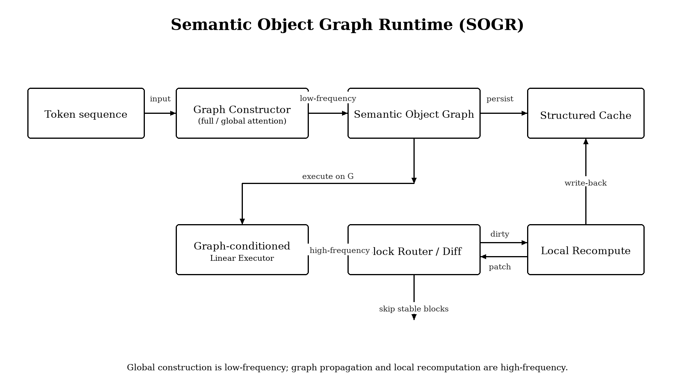
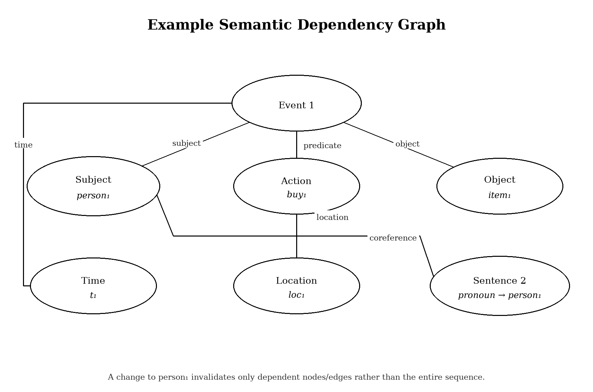

# SOGR：语义对象图运行时

**语言：** [English](SOGR.md) · **简体中文** · [项目 README](../README.zh.md)

**面向长上下文语言建模的结构化增量架构**

Zeping Tu  
前端工程师  
独立研究草案 · 版本 0.3 · 2026 年 9 月  
仓库：https://github.com/heiyantutu/sogr

## 摘要

本文提出 SOGR：一种语言模型架构，把语义依赖结构当成显式的计算中间表示，而不是强迫每一层都在 token 序列上重新发现关系。核心假设是：相对低频的全局注意力阶段可以构造或修复语义对象图（SOG），随后由受图约束的线性状态传播承担高频计算。结构化缓存存放节点、边与块状态；块级变化检测提供粗粒度路由，精神上类似于响应式用户界面里的脏区域传播。当局部变量、实体或关系变化时，只重算其依赖子图，无关状态保留。缓存是对象图而不是稠密的逐层键值张量，因此还有一条部署假设：可移植部分可以放在客户端，服务器保留模型权重并做图约束计算。模型特定的隐藏态视为短暂物化；结构和紧凑的规范嵌入可以被 lift 进新模型的坐标系，而不是尝试翻译原始 KV 张量。架构组合五个想法：（1）低频全局构图，（2）高频图约束线性执行，（3）周期全局图修复，（4）分层块级跳过，（5）把可移植结构与模型绑定激活分开的三层缓存。我们给出有条件的复杂度模型：只有构图被摊销、依赖足够稀疏、图维护开销有界时，才可能优于稠密注意力。可移植缓存同样有条件：lift 一张已存图必须比全文 prefill 便宜，且图必须小到可以离开加速器。本稿是研究提案加上 CPU 笔记本基线，不是 GPU 规模训练报告。不声称 SOGR 已在生产尺度上达到全注意力质量。意图贡献是显式架构假设、可证伪实验方案，以及非游戏本上目前能量到的地板。

**关键词：** 语义对象图；增量计算；结构化缓存；可移植工作记忆；线性注意力；稀疏计算；块路由；长上下文语言建模；与模型无关的中间表示

---

## 1. 引言

基于 Transformer 的语言模型主要把上下文表示为 token 状态序列，并反复用注意力推断这些状态之间的交互。这种设计强大，因为它几乎不预设哪些关系重要。代价是关系发现反复与信息传播缠在一起。即便有效依赖模式稀疏，常规稠密注意力也不会把这种稀疏性暴露为一等计算对象。

因此提出另一个设计问题：若模型先构造一份显式、可复用的语言关系表示，后续计算作用在这份表示上，而不是每一层重新发现关系，会怎样？研究方向来自前端工程。React、Vue 这类响应式框架把结构化视图（虚拟 DOM 或响应式依赖图）与渲染分开：局部状态变化只弄脏依赖子树，无关区域跳过。类比不是「自然语言等于 DOM」。可迁移的是运行时契约：结构编译一次，增量执行，持久化对象而不是像素。编译器中间表示和抽象语法树提供同样的「结构 / 执行」分裂。SOGR 问的是：语言模型能否按语义对象图来组织。

SOGR 把该想法形式化为四阶段运行时。第一，全局注意力模块构造语义对象图（SOG）。第二，图约束线性算子沿图传播状态。第三，经过可配置的线性步数后，全局注意力模块修复或扩展图。第四，分层块摘要决定某区域是否足够稳定从而跳过细粒度计算。结构化缓存保存结果状态与失效元数据。

若缓存既小又结构显式，运行时边界可以移动。常规 KV cache 绑在服务进程上，因为它又大，又写在模型私有的层与头基里。语义对象图可以改成本地工作记忆对象。服务器主要出售计算：把可移植图 lift 进当前模型隐藏空间，只执行被失效的子图，返回带版本的补丁。换模型变成转换这份结构化对象，而不是翻译原始 KV 张量。

提案有意窄于「稀疏注意力或线性注意力已经够用」。现有高效架构已经表明线性时间序列处理与混合注意力可以实用。所提新意在于计算的组织方式：关系发现成为显式、可缓存的状态；计算成为增量图更新问题；该状态可移植的残余原则上可以离开加速器。

## 2. 设计动机

这一研究方向最初考虑的第一代效率想法是 token 选择：找出显著位置，丢掉其余。这类方法可以减少计算，但仍然把 token 序列当根本对象。所提架构改为：在决定算什么之前，先把底层依赖结构显式化，就像前端框架 diff 组件树，而不是重绘整份文档。

考虑句子 “Alice bought a laptop in Hangzhou because her old computer failed.” 纯 token 表示要求模型推断 “her” 指 Alice、“old computer” 与 “laptop” 不同、因果从句解释购买语境。结构化表示可以把这些暴露为候选节点和边。重要的是，图不必语言学上完美；可以带权、不确定、可修订。

因此关键工程原则是：昂贵的全局关系发现少做，把发现到的结构复用到许多更便宜的传播步上。这类似于把程序编译成中间表示再反复执行，而不是每次操作都重新解析源码。

第二条原则来自同一编译类比。源码和 IR 可以跟用户走；编译器或运行时可以远程，对长寿命上下文无状态。Token 级 KV cache 不能扮演这个角色：既太大，难以廉价往返，又与一套权重耦合过紧。稀疏对象图只有在结构与模型特定激活分开存放时，才有资格扮演这个角色。

## 3. 语义对象图

设长度为 \(L\) 的 token 嵌入序列为 \(X = \{x_1,\ldots,x_L\}\)。SOGR 引入图 \(G=(V,E,A)\)，其中 \(V\) 含 token、短语、实体、事件或潜在语义对象；\(E\) 含带类型依赖关系；\(A\) 存放关系置信或路由权重。图可以分层：token 级节点属于短语节点，再属于句子或块节点。

最小图节点可写成 \(N_i = (h_i, c_i, \mathrm{type}_i, \mathrm{span}_i, \mathrm{parent}_i, \mathrm{version}_i)\)，其中 \(h_i\) 是当前模型隐藏态，\(c_i\) 是可选规范语义向量，\(\mathrm{version}_i\) 支持缓存失效。边为 \(E_{ij} = (r_{ij}, w_{ij}, \mathrm{version}_{ij})\)，\(r_{ij}\) 为关系类型，\(w_{ij}\) 为学习或推断的强度。与固定句法分析不同，图允许被后续全局遍修订。\((\mathrm{type}, \mathrm{span}, \mathrm{parent}, r)\) 意在成为与模型无关的骨架；\(h_i\) 不是。

与常规稀疏注意力的重要区别是：图意在成为持久计算状态。稀疏注意力掩码通常是单层路由决策。在 SOGR 中，图可以跨越多个线性执行阶段持续存在，因而可以作为增量重算的索引。跨服务会话、跨模型的持久化是更强主张，单独放在第 5 节。

## 4. 架构

架构由四个主算子组成：全局构图器（GGC）、图约束线性执行器（GLE）、周期图修复（PGR）、分层块路由器（HBR）。它们一起实现与响应式前端运行时相同的契约：编译结构、沿依赖执行、跳过稳定区域、持久化对象而不是完整视觉（此处则是 token 级）转储。

React / Vue 到 SOGR 的映射：

| 响应式 UI 运行时 | SOGR |
|---|---|
| 源码 / 模板 | token 序列 \(X\) |
| 编译为 VDOM 或响应式图 | GGC 构造 \(G=(V,E,A)\) |
| 组件树与带类型边 | 语义对象与带类型关系 |
| 状态写入弄脏依赖 | 版本递增；脏集 \(I=\mathrm{Desc}_G(\Delta)\cup\Delta\) |
| 跳过未变化子树 | HBR 跳过稳定块 |
| 重绘脏区域 | 在 \(I\) 上跑 GLE |
| 持久化组件状态，不是像素 | 持久化 \(S\) 与 \(C\)，不是原始 KV |
| 渲染器可替换 | 模型 \(\phi\) 可通过 \(\mathrm{Lift}_\phi(C,S)\) 替换 |

预期控制流是循环，不是一次性解析：

1. **GGC** 读取 \(X\)（以及可选的上一张图），发出或补丁 \(G\)。该步昂贵且低频。
2. 对 \(k = 1,\ldots,K\)：**HBR** 标记稳定块；**GLE** 只沿图支持的边、在活跃区域更新隐藏态；结构化缓存记录版本。
3. 若 \(|I|\) 超过安全阈值，或经过 \(K\) 个线性步，**PGR** 修复 \(G\)（增、删、拆、合、改权或确认）。
4. 解码或外部编辑产生新的 \(\Delta\)。失效是结构性的：重算 \(I\)，而不是整段序列，除非强制 PGR。

### 4.1 全局构图器

全注意力或其他高容量模块检查当前状态，提出图节点与带权关系。昂贵操作有意低频。不假设一张图永远正确。GGC 类似于编译视图树：允许对 \(L\) 二次，因为代价摊销到随后 \(K\) 个线性步。若 GGC 几乎每层都跑，架构塌成昂贵的混合注意力模型，假设失败。

### 4.2 图约束线性执行器

给定 \(G\)，线性算子只沿图支持的关系传播状态。一种通用写法是

\[
h'_i = U h_i + \sum_{j \in N(i)} w_{ij} V_{r_{ij}} h_j,
\]

随后做门控状态更新。邻居 \(N(i)\) 是图邻域，不是长度为 \(L\) 的全序列。关系特定映射 \(V_{r_{ij}}\) 让不同边类型（共指、因果、父子）以不同方式混合信息，类似于 UI 树里带类型的 props 与泛化的父子链接。

实现可以使用 gated linear attention、delta-rule 记忆、类 SSM 状态转移，或其他线性时间机制。因此架构不依赖某一种线性注意力公式。不变量是：高频工作**执行** \(G\)，而不是重新发现 \(G\)。

### 4.3 周期图修复

经过 \(K\) 个线性执行步后，全局模块重新评估图。它可以加边、删陈旧边、改权重、拆节点、合节点，或只确认当前结构仍有效。这是针对纯线性模型有限状态与检索局限的机制，也类似于局部脏跟踪不再可信时的全量重绘或 React reconciliation（例如语篇转换产生新的长程链接之后）。

### 4.4 分层块路由器

Token 被分成块。每块维护紧凑摘要 \(z_b\) 与变化指示 \(\Delta_b\)。若新查询或上游状态与稳定块交互足够低，该块可绕过细粒度计算。路由单元有意按块，因为连续块执行比任意 token 级稀疏更硬件友好。无法打成块的语义稀疏，理论上仍稀疏，实践上可能慢于稠密注意力；因此 HBR 是架构假设的一部分，不是可选内核技巧。

### 4.5 结构化缓存

缓存存放节点状态、边状态、块摘要与依赖版本。节点 \(i\) 的变化递增其版本，只失效沿图可达的后代或依赖者。缓存有效性因此是结构性的，而不纯是位置性的。对内，这是增量计算存储。对外，只有子集才是客户端持久化的候选，定义见下一节。

## 5. 可移植结构化缓存

本节是部署假设，不是四阶段运行时的必需性质。它问：使增量重算成为可能的同一份 IR，能否也成为可携带的工作记忆对象。

### 5.1 为什么 token KV 搬不走

常规键值缓存是一叠张量，布局由层数、头几何、位置编码以及产生它的权重矩阵决定。它大，因为按每个 token、每一层存一份状态；它不可移植，因为这些状态活在私有基里。搬到客户端通常没有意义：载荷与放在加速器上相当，而且另一模型消费不了。

当 \(|V| \ll L\) 且边集保持稀疏时，语义对象图更小。体积本身不够。若本地存放的对象只是 \(H\) 的压缩副本，它仍绑定模型。可移植性要求明确分开「什么是对象」和「什么是物化」。

### 5.2 三层缓存

结构化缓存分解为 \(M = (S, C, H)\)：

- \(S\) 是结构：节点身份、类型、span、父链接、带类型边、版本。\(S\) 是与模型无关骨架的候选，类似于 AST 或带类型依存图。
- \(C\) 是规范语义：共享嵌入空间中每个节点的紧凑向量 \(c_i\)，由不与某一个 LLM 等同的小编码器产生。\(C\) 是仍携带意义的可移植载荷候选。
- \(H\) 是模型状态：当前隐藏向量 \(h_i\)、表达在服务模型路由空间中的边权、块摘要 \(z_b\)。\(H\) 是当前权重的草稿物化。

意图不变量是：\(S\) 与 \(C\) 可以本地、跨会话存放，而服务模型一换就可以丢弃 \(H\)。跨模型复用因此不是「KV 翻译」，而是 lift：

\[
H = \mathrm{Lift}_\phi(C, S).
\]

\(\mathrm{Lift}_\phi\) 是模型特定投影，可能再对不确定边做一次廉价局部修复。全文 token prefill 是 lift 不足时的回退，不是默认路径。

### 5.3 客户端对象，服务器计算

在这一分裂下，请求可写成 \((q, S, C, \Delta)\)，\(q\) 为新查询或编辑，\(\Delta\) 为客户端声明的脏集。服务器（i）为当前权重把 \(C\) lift 成 \(H\)，（ii）用 \(I = \mathrm{Desc}_S(\Delta) \cup \Delta\) 扩展失效，（iii）只在 \(I\) 上跑 GLE，必要时跑 PGR，（iv）返回 token 以及带版本补丁 \(\Delta S, \Delta C\)。客户端合并补丁。长寿命上下文不必在两次调用之间占据 HBM。

这颠倒了通常的前缀缓存设计。前缀缓存把张量放在权重旁边，因为张量巨大。SOGR 把对象放在用户旁边，因为对象有结构，并且在第 7 节的稀疏条件下足够小。加速器更接近无状态的图约束执行器。

通信代价是假设的一部分。设 \(s\) 为可移植缓存的序列化大小。只有当 \(s\) 远小于 token 级 KV 快照、且增量补丁更小时，拆分执行才有吸引力。若图在 FLOP 上稀疏、在元数据上稠密，就会通不过这一测试。

### 5.4 更换模型

新模型 \(\phi'\) 不继承 \(H\)。它继承 \(S\) 与 \(C\)，再计算 \(H' = \mathrm{Lift}_{\phi'}(C, S)\)。若新模型的类型或关系词表不同，可先应用模式映射 \(T(S) \to S'\)。残余不确定性由 PGR 处理，而不是假装两个模型共享隐藏基。

这里唯一重要的效率主张是比较性的：对有用的一类文档和模型对，lift 加局部修复必须打败原 token 序列上的全文 prefill。若做不到，可移植缓存只是存储便利，不是计算便利。

### 5.5 不声称什么

不假设原始逐层键值可在模型间线性对齐。不假设本体漂移无关紧要：代码模型与对话模型可能从同一文本诱导出不同节点粒度，此时必须重建或调和 \(S\)。不假设客户端提供的边可信；执行并非自己构造的图的服务器需要校验或修复策略。这些保留是假设的一部分，不是事后补丁。

## 6. 数学表述

设 \(G_t\) 为全局修复步 \(t\) 的图。全局构造器为 \(G_t = C_\theta(X_t, G_{t-1})\)，其中 \(C_\theta\) 可以使用全注意力。修复之间施加 \(K\) 次线性更新：\(H_{t,k+1} = F_\phi(H_{t,k}, G_t, M_t)\)，\(M_t\) 为缓存状态。

通用图约束线性更新可写成：

\[
H' = \sigma\big( H W_0 + P_G(H) W_1 \big), \quad P_G(H)_i = \sum_{j \in N(i)} A_{ij} H_j.
\]

此处 \(P_G\) 是图传播算子。若图含 \(E\) 条活跃边，传播项对隐藏宽度 \(d\) 为 \(O(E d)\)，忽略实现相关的投影代价。中心要求是 \(E\) 显著小于 \(L^2\)，且图维护不会吃掉节省。

对块路由，设 \(b\) 为块下标，\(z_b\) 为块摘要。定义稳定性分数 \(s_b = g(z_b, q)\)，\(q\) 为当前查询/状态。当 \(s_b < \tau\) 且依赖版本未变时跳过该块。活跃计算成为活跃块集 \(B_{\mathrm{active}}\) 的函数，而不是全部 \(B\) 块。

缓存失效规则可写成 \(I_{t+1} = \mathrm{Desc}_G(\Delta_t) \cup \Delta_t\)，\(\Delta_t\) 为变化节点集，\(\mathrm{Desc}_G\) 为其依赖后代。这给出增量计算的显式目标：只重算 \(I_{t+1}\)，并受安全策略约束：失效过大时强制全局修复。

对可移植缓存，按第 5 节写 \(M=(S,C,H)\)。固定模型服务为 \(H_{t} = \mathrm{Lift}_\phi(C_{t}, S_{t})\) 再跟上上述更新。新模型服务为 \(H' = \mathrm{Lift}_{\phi'}(C, T(S))\)，可选跟一次修复。关系模式共享时 \(T\) 为恒等。

## 7. 有条件复杂度分析

提案不支持不加限定地声称 \(O(L)\) 复杂度。若每 \(K\) 层做一次全局构图，摊销代价含全局项。设 \(c_g L^2\) 为一次全局遍代价，\(c_e E\) 为一次图执行代价，\(c_m I\) 为维护/失效代价，\(I\) 为受影响节点或边数。在 \(K\) 个执行步上，简化平均代价为：

\[
C_{\mathrm{avg}} \approx \frac{c_g L^2}{K} + c_e E + \frac{c_m I}{K}.
\]

当该量低于对应稠密注意力基线且保住模型质量时，架构才有优势。若 \(E=\rho L^2\)，图项仍二次，架构可能几乎没有渐近收益。期望区间因此是 \(\rho \ll 1\)、较大的 \(K\)、较小的平均失效规模 \(I\)。

这一条件重要。提案不应被表述为不加限定的「Transformer 变成 \(O(L)\)」。意图收益是摊销且有条件的：昂贵的全局关系发现被复用，稳定或无关区域不被反复重算。

增量解码或编辑时还可能有进一步收益。若只有一小块语义区域变化，相关代价可以随受影响依赖子图缩放，而不是随完整上下文，前提是图仍然有效且任务允许这种局部性。

拆分执行增加通信项 \(c_s s\)，\(s\) 为 \(S \cup C\) 或补丁的大小。跨模型复用把量级为 \(c_g L^2\) 的 prefill 换成量级为 \(c_\ell |V|\) 的 lift 外加修复。该替换只有在匹配质量下 \(c_\ell |V| + c_{\mathrm{repair}} \ll c_g L^2\) 时才有利。同上警告：这是区间，不是恒等。

## 8. 与已有工作的关系

SOGR 与若干已确立方向相关，但不等于其中任何一个。线性注意力把注意力改写成线性序列复杂度，并暴露出循环/快权重解释。Mamba 及相关选择性状态空间模型同样追求高效长序列处理，并处理内容依赖记忆。Kimi Linear 表明混合架构可以交错线性注意力与周期全局注意力，并取得强的长上下文效率。

稀疏注意力通过限制交互集合减少计算，常用固定窗口、学习路由、哈希或 chunk 选择。此处提出的概念区分是：交互结构被当成持久中间表示，而不仅仅是一次注意力操作的掩码。

LLM 之外最接近的概念亲戚是增量编译器、带物化视图的数据库、基于依赖的构建系统，以及响应式 UI 框架。每一种情况下，依赖结构都允许局部变化传播而不重算无关状态。研究问题是：同一计算原则能否在语言表示上可靠，而语言依赖不确定且对上下文敏感。

系统侧，分页与前缀 KV 缓存把绑定模型的张量放在权重附近。语义缓存与检索增强记忆存放模型可以重读的文档或嵌入，但它们不是用于增量隐藏态更新的可执行依赖图。表示对齐方法可以在空间之间映射向量；它们本身不给出运行时可以失效的、带类型、带版本的对象。SOGR 的可移植缓存主张是组合：客户端持有的 IR，其结构索引计算，其规范向量可被 lift，而不是必须存放在 GPU 旁的一坨键值。

因此本稿主张架构假设，而不是对所有组成技术的优先权。正式新颖性/优先权判定需要超出本草案范围的系统文献与专利检索。

## 9. 训练策略

实用训练策略是从常规 Transformer 或混合线性注意力模型出发，为图质量引入辅助监督。候选图边可来自注意力模式、共指链接、依存分析、潜在探针或学习到的边预测器。图最终应端到端可训练，而不是需要人工标注。

一种可能目标是 \(L = L_{\mathrm{lm}} + \lambda_r L_{\mathrm{relation}} + \lambda_s L_{\mathrm{stability}} + \lambda_i L_{\mathrm{invalidation}}\)。\(L_{\mathrm{lm}}\) 是普通语言建模损失。\(L_{\mathrm{relation}}\) 鼓励有用的依赖预测。\(L_{\mathrm{stability}}\) 在语义状态未变时鼓励图持续。\(L_{\mathrm{invalidation}}\) 惩罚不必要的重算或错误的局部性假设。

课程可以从固定图或教师生成图开始，再逐步去掉外部结构监督。这让模型先学会运行时语义，再被要求独立发现结构。

若训练可移植缓存，\(\mathrm{Lift}_\phi\) 应对同一文档全量前向得到的隐藏态做监督，同时用重建或稳定性项保持 \(C\) 有信息量、而不塌成 \(H\) 的副本。跨模型 lift 可以在两个冻结骨干上对同一 \((S,C)\) 的成对物化上训练。这些目标是运行时的可选扩展，不是测试增量重算的前提。

## 10. 实验方案

第一个实验不应训练十亿参数模型。小型受控模型足以检验中心假设。关键比较不仅是困惑度或基准分数，还有每次有用更新的计算量以及依赖局部性。

建议评估包括：

1. 等 FLOPs 语言建模困惑度
2. 长上下文检索，如 MQAR 与大海捞针变体
3. 精确复制与联想回忆测试
4. 语义编辑测试：修改一个实体或事实，测量所需重算区域
5. 相对自动生成依赖探针的图精确率/召回率
6. 使用块稀疏核的端到端 GPU 吞吐
7. 对图刷新频率 \(K\)、块大小、图密度 \(\rho\)、缓存失效阈值 \(\tau\) 的消融

决定性实验是编辑局部性基准。构造带显式依赖链的文档。在中间改一个事实，再测量为恢复与全量重算相同的输出质量必须重算多少隐藏态。中心假设预测：对有意义的一类编辑，受影响子图将显著小于完整上下文。

最终模型内实验应在匹配参数量、训练 token、硬件与质量目标下，比较 SOGR 与全注意力、强线性注意力基线、标准混合架构、以及 chunk 稀疏注意力基线。

可移植缓存实验是分开的，即使小模型也可以跑：

8. 同一上下文长度下 \(S \cup C\) 序列化大小对 token 级 KV
9. \(\mathrm{Lift}_\phi(C,S)\) 相对原 token 全文 prefill 的质量与 FLOPs
10. 跨模型迁移：在模型 \(\phi\) 下存储 \((S,C)\)，lift 进 \(\phi'\)，与 \(\phi'\) 上的 prefill 比较
11. 仅局部编辑时，客户端持有缓存的补丁大小与往返延迟
12. 模式不匹配：在节点粒度不同的模型之间迁移图，测量 PGR 必须重建 \(S\) 的频率

部署假设的决定性反例容易陈述。若 lift 不重读大部分 token 就接近不了 prefill 质量，或 \(s\) 并不显著小于 KV，则对象图仍是内部 IR，不应宣传为客户端工作记忆。

纳入 CPU 尺度基线，是因为作者目前只有非游戏本（CPU，无 CUDA）。该硬件是实验地板，不是 SOGR 的意图尺度。

在 `experiments/llm_to_object` 中，CPU 上的 DistilGPT-2（约 82M）把 156 token 段落收成 54 个节点、115 条边。序列化 \(S \cup C\) 为 31 KB，相对 5.6 MB 的 KV 快照（该玩具上约 \(184\times\) 更小）。一处编辑 `Shanghai → Beijing` 在一跳弄脏 3.7% 节点，传递闭包下 40.7%，相对全文 prefill 的 100% token。因此在这个地板上体积与对象化成立；一跳局部性成立；传递局部性只是部分成立，因为注意力图比语言学依存图更密。

在 `experiments/compiler_lite` 中，同一序列化图作为唯一上下文喂给两个 0.5B 指令模型（Qwen2.5-0.5B-Instruct 与 Qwen2-0.5B-Instruct），对照喂原始段落。两个模型全文在六道事实题上均为 6/6；对象图为 3/6。这是 compiler-lite（S 作为可读上下文），不是 KV 编译器。对可移植性的支持很弱，并警告当前抽取/序列化会丢掉答题关键结构。

这些运行不替代 GPU 规模困惑度、长上下文检索、或真正的 \(S{+}C \to\) KV lift。它们是当前机器能够诚实支撑的上限。

## 11. 局限与失败模式

自然语言依赖不是确定性 AST 边。代词、语篇关系、否定、反讽、世界知识与长程语义交互可以让看似局部的图失效。因此安全系统需要带不确定度的边，以及强制全局修复的机制。

构图本身可以很贵。若构造器必须反复做近乎全注意力，预期节省会消失。架构因而依赖图修复之间足够长的间隔，以及该间隔内图仍然有用。

硬件稀疏是另一局限。任意图遍历在 GPU 上可以慢于稠密矩阵乘。因此块级分组不是可选实现细节，而是架构假设的一部分。图应尽可能暴露连续、可批处理的区域。

最后，更小的计算图并不意味着相同的模型质量。图可能丢掉弱但重要的长程依赖。系统因此必须为安全近似优化，而不仅仅为最大稀疏。

可移植缓存带来进一步失败模式。隐藏态不是共享坐标系；即使 \(S\) 可复用，跨模型映射 \(H\) 也很可能失败。规范向量 \(C\) 可能过于有损，以致 lift 又便宜又错。关系模式可能不对齐，于是「转换」变成重新解析。客户端持有的图是高价值个人制品，若服务器执行不受信的边，也可能成为注入面。这些问题没有一个单靠稀疏就能解决。

再一条局限是计算预算。本稿全部测量来自无独显的 CPU 笔记本。0.5B 级指令模型与 DistilGPT-2 是目前上限。结果应读作地板，而不是关于 7B 级模型或 16K–128K 上下文的证据。

## 12. 结论

SOGR 提议改变语言模型的计算抽象。不再把 token 序列当作唯一持久状态、并在每一层重新发现关系，架构引入语义对象图作为可缓存中间表示。全局注意力构造并修复该表示；图约束线性算子做反复传播；结构化缓存保留稳定状态；分层块路由避免不必要计算。

提案有意可证伪。成败取决于可测量条件：图稀疏性、图稳定性、失效局部性、构造器频率、硬件效率。若这些条件失败，架构退化成昂贵的混合注意力系统，优势很小。若成立，同一原则可能通向增量语言模型运行时：计算单元不是 token 序列，而是依赖子图。

因此中心研究问题不是「如何让 Transformer 注意力稍便宜一点」，而是「语言能否被编译成稳定计算结构，使模型只更新变化的部分？」后续问题是该结构能否离开加速器：用户持有对象，服务器只持有权重，新模型 lift 对象而不是继承 KV 张量。SOGR 是用于检验这两个问题的具体架构假设。

## 13. 本草案声称的贡献

- 面向语言模型的语义对象图运行时抽象
- 低频全局关系构造与高频图约束执行的分离
- 用于增量重算的结构化缓存与依赖版本机制
- 把可移植结构、规范语义与模型绑定激活分开的三层缓存 \((S,C,H)\)
- 客户端存对象图、服务器做图约束计算的拆分运行时假设
- 基于 lift \((S,C)\) 而非翻译原始 KV 张量的跨模型复用假设
- 意在让语义稀疏对齐 GPU 友好连续计算的分层块 diff 机制
- 可证伪模型内效率优势与可移植缓存部署主张的有条件复杂度模型与实验协议
- 笔记本 CPU 基线：DistilGPT-2 上的对象化与 KV 体积下降、部分编辑局部性，以及两个 0.5B 模型仅从 \(S\) 答题时下降 50%

## 参考文献

1. Vaswani, A. et al. *Attention Is All You Need*. NeurIPS, 2017.
2. Katharopoulos, A., Vyas, A., Pappas, N., Fleuret, F. *Transformers are RNNs: Fast Autoregressive Transformers with Linear Attention*. ICML/PMLR 119, 5156–5165, 2020.
3. Schlag, I., Irie, K., Schmidhuber, J. *Linear Transformers Are Secretly Fast Weight Programmers*. ICML/PMLR 139, 9355–9366, 2021.
4. Kitaev, N., Kaiser, Ł., Levskaya, A. *Reformer: The Efficient Transformer*. ICLR, 2020.
5. Gu, A., Dao, T. *Mamba: Linear-Time Sequence Modeling with Selective State Spaces*. arXiv:2312.00752, 2023.
6. Kimi Team et al. *Kimi Linear: An Expressive, Efficient Attention Architecture*. arXiv:2510.26692, 2025.
7. Veličković, P. et al. *Graph Attention Networks*. ICLR, 2018.
8. Kim, Y., Denton, C., Hoang, L., Rush, A. M. *Structured Attention Networks*. ICLR, 2017.
9. Loynd, R. et al. *Working Memory Graphs*. ICML/PMLR 119, 6404–6414, 2020.
10. Dao, T. *FlashAttention: Fast and Memory-Efficient Exact Attention with IO-Awareness*. NeurIPS, 2022.
11. Dao, T. et al. *FlashAttention-2: Faster Attention with Better Parallelism and Work Partitioning*. ICLR, 2024.
12. Beltagy, I., Peters, M. E., Cohan, A. *Longformer: The Long-Document Transformer*. arXiv:2004.05150, 2020.
13. Child, R. et al. *Generating Long Sequences with Sparse Transformers*. arXiv:1904.10509, 2019.
14. Liu, Y. et al. Blockwise Parallel Transformer for Long Context Modeling. Related line of chunk/block efficient sequence modeling; see contemporary long-context literature.
15. McKinley, K. S. et al. Compiler and incremental computation literature on dependency-directed recomputation; the analogy motivates the runtime design but is not claimed as a new compiler technique.

## 原创性与归属说明

本稿将 SOGR 架构作为源自作者本人概念发展的研究提案。它有意把所提组合与系统级抽象，同先前关于线性注意力、稀疏注意力、图、缓存、混合架构、前缀 KV 存储、表示对齐的工作区分开。论文不声称每一个单独组件都新颖，也不在全面现有技术检索之前声称已证明的优先权。所有数值复杂度陈述除非明确标识为所引工作的报告结果，否则都是分析条件或说明性例子。可移植缓存、客户端对象与跨模型 lift 被陈述为带显式证伪条件的部署假设，而不是已演示的系统性质。
